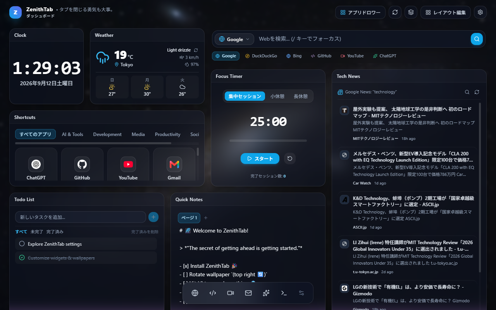

<div align="center">


# ZenithTab

**Ein schnelles, schönes und tief anpassbares Neuer-Tab-Dashboard für Google Chrome.**

Widgets per Drag & Drop, Glas-Optik, dynamische Hintergründe, 7 Sprachen – alles lokal, ohne Konto, ohne Tracking.

[](https://github.com/miyabiver39/ZenithTab/actions/workflows/build.yml)
[](https://github.com/miyabiver39/ZenithTab/releases/latest)
[](../../LICENSE)
[](../../manifest.json)
[](../../tsconfig.json)
[](../../package.json)
[](../../src/i18n/locales)
[](../../tests)

[**Installation**](#-installation) · [**Funktionen**](#-funktionen) · [**Entwicklung**](#️-entwicklung) · [**Änderungsprotokoll**](../../CHANGELOG.md) · [**Datenschutz**](../../PRIVACY.md)

[English](../../README.md) · [日本語](README.ja.md) · [简体中文](README.zh-CN.md) · [Español](README.es.md) · [Français](README.fr.md) · **Deutsch** · [한국어](README.ko.md)



</div>

---

## ✨ Funktionen

### Widgets

| Widget | Was es tut |
| :-- | :-- |
| 🔍 **Schnellsuche** | Suchleiste mit mehreren Suchmaschinen (Google, Bing, DuckDuckGo, GitHub, YouTube, ChatGPT + eigene). **Schnellantworten** direkt in der Leiste: `120*1.1`, `20% of 150`, `10 km to mi`, `0xff`, `2d6`, `coin`, `random 1-100`, `choose a, b, c`, `days until 2026-12-31`. |
| 🌐 **Verknüpfungen** | Deine Lieblingsseiten als Kacheln, mit Favicons aus Chromes eigenem Cache. |
| ⏰ **Uhr** | Digital / analog / minimal, Sekunden, Datum, Zeitzone. |
| 🌤️ **Wetter** | Aktuelle Lage und 3-Tage-Vorhersage (Open-Meteo), Standort auf Wunsch per Klick. |
| 🔖 **Lesezeichen** | Chrome-Lesezeichen durchsuchen und durchstöbern, Ordner inklusive. |
| 📰 **Nachrichten & RSS** | Google News (Schlagzeilen, Themen, Stichwortsuche) oder beliebige RSS-/Atom-Feeds, im Hintergrund aktualisiert. |
| ⏱️ **Fokus-Timer** | Pomodoro-Sitzungen mit kurzen/langen Pausen und Sitzungszähler. |
| ✅ **Aufgaben** | Einfache To-do-Liste mit Filtern und rückgängig machbarem Löschen. |
| 📝 **Schnellnotizen** | Mehrseitiger Markdown-Notizblock. |
| 🖼️ **Web-Einbettung** | Beliebige Seite oder Tool als iframe, mit Ersatzkarte für Seiten, die Einbettung verweigern. |
| ⚡ **Schnellzugriff** | Chromes meistbesuchte Seiten und kürzlich geschlossene Tabs (an Ort und Stelle wiederherstellbar). |
| 📱 **QR-Code** | URL, Telefonnummer oder Text als QR-Code – Link aufs Handy schicken. |
| ⏳ **Countdown** | Tage bis Geburtstag, Reise, Prüfung oder Frist; jährliche Wiederholung. |
| 🔥 **Gewohnheiten** | Tägliche Gewohnheiten abhaken und die Serie halten. |
| 📅 **Kalender** | Heutige und kommende Termine aus jedem iCal-Link (.ics) – Google Kalender, Outlook, Apple. |

### Dashboard

- 🧩 **Freies Raster** – Widgets ziehen, skalieren und anordnen; Widgets lassen sich bis auf 2 Spalten verkleinern.
- 📑 **Mehrere Seiten** – getrennte Dashboards (Arbeit / Zuhause / …), umschaltbar mit `Strg+Alt+←/→`.
- 🖼️ **Hintergründe** – Unsplash-Sammlungen, Verläufe oder eigenes Bild; ein **Tageszeit-Modus** wechselt den Look von morgens bis nachts; auf hellen Hintergründen wird der Text automatisch dunkel.
- 🎨 **Glas-Optik** – Unschärfe, Eckenradius und Dock einstellen.
- ↩️ **Fehlertolerant** – jedes Löschen und jede Layout-Änderung rückgängig machen (`Strg+Z`), 30-Tage-Papierkorb für Widgets und Seiten, automatische Sicherungen vor riskanten Aktionen.
- ⌨️ **Tastenkombinationen** – eingebaute (`/` für die Suche, Rückgängig/Wiederholen, Seitenwechsel) plus eigene Kombinationen, die beliebige URLs öffnen.
- 🌍 **7 Sprachen** – English, 日本語, 简体中文, Español, Français, Deutsch, 한국어; die Voreinstellungen folgen deiner Region (Suchmaschinen, News-Ausgabe, Wetterstadt, Dock).
- 🔄 **Import / Export** – das ganze Dashboard als eine JSON-Datei.
- 🔒 **Lokal zuerst** – alles liegt in `chrome.storage.local`. Kein Backend, keine Analytik, kein Tracking.

---

## 🚀 Installation

### Aus einem Release (empfohlen)

1. `zenith-tab-vX.Y.Z.zip` vom [neuesten Release](https://github.com/miyabiver39/ZenithTab/releases/latest) herunterladen und entpacken.
2. `chrome://extensions/` öffnen und den **Entwicklermodus** (oben rechts) einschalten.
3. **Entpackte Erweiterung laden** klicken und den entpackten Ordner wählen.
4. Einen neuen Tab öffnen.

> Du aktualisierst eine manuell geladene Installation? Lade die neue Version in einen **neuen Ordner** (oder klicke ↻ auf der Erweiterungskarte) – Chrome liest `manifest.json` nur beim Neuladen ein, ein Überschreiben der Dateien lässt die Berechtigungen veraltet.

### Aus dem Quellcode

```bash
git clone https://github.com/miyabiver39/ZenithTab.git
cd ZenithTab
npm install
npm run build      # → dist/
npm run verify     # prüft das gepackte Manifest gegen dist/
```

Anschließend `dist/` wie oben als entpackte Erweiterung laden.

---

## 🔐 Berechtigungen und Datenschutz

| Berechtigung | Wozu |
| :-- | :-- |
| `storage`, `unlimitedStorage` | Dashboard, Notizen und Caches bleiben auf deinem Gerät; keine 10-MB-Grenze für eigene Hintergründe |
| `bookmarks` | Das Lesezeichen-Widget |
| `alarms` | Feed-Aktualisierung im Hintergrund |
| `favicon` | Seitensymbole aus Chromes lokalem Cache – kein Icon-Dienst von Dritten |
| `geolocation` | Einmal gelesen, nur wenn du auf „Aktuellen Standort ermitteln“ klickst |
| Host-Berechtigungen | Wetter (Open-Meteo), Google News, Unsplash-Hintergründe |
| Optional: `topSites`, `sessions`, `tabs` | Angefragt beim Hinzufügen des Schnellzugriff-Widgets (meistbesuchte Seiten, kürzlich geschlossene Tabs und ihre Titel) |
| Optionale Host-Berechtigungen | Pro Ursprung angefragt, genau dann, wenn du einen eigenen RSS-Feed oder Kalender hinzufügst |

Kein Backend, keine Analytik, kein Tracking. [PRIVACY.md](../../PRIVACY.md) listet jede ausgehende Anfrage auf.

---

## 🛠️ Entwicklung

| Aufgabe | Befehl |
| :-- | :-- |
| Dev-Server (HMR) | `npm run dev` → http://localhost:5173/newtab.html |
| Build | `npm run build` |
| Lint / Typen / Unit-Tests | `npm run lint` · `npm run typecheck` · `npm run test:run` |
| E2E (Playwright) | `npm run test:e2e` |
| Abdeckung | `npm run test:coverage` |
| Release | `npm run version:bump X.Y.Z` → `npm run package` (vorher den Dev-Server stoppen) → `git push origin main --tags` |

**VS Code**: Das Repository bringt `.vscode/` mit – `Strg+Umschalt+B` baut, `F5` startet den Dev-Server und öffnet Chrome mit funktionierenden Haltepunkten („Debug new tab“) oder lädt die gebaute Erweiterung („Debug extension“). Die Aufgabe „check all“ führt lint → typecheck → Tests aus, dieselbe Hürde wie in der CI.

Ein gepushter `v*`-Tag baut ZIP und SBOM und veröffentlicht ein GitHub Release.

### Technik

React 19 + TypeScript (strict) · Vite + `@crxjs/vite-plugin` · Tailwind CSS + Lucide-Icons · `react-grid-layout` · Zustand · `fast-xml-parser` · Vitest + Testing Library + Playwright

### Projektstruktur

```text
src/
├── background/service-worker.ts   # Feed-Aktualisierung im Hintergrund (chrome.alarms)
├── components/
│   ├── common/                    # Modal, Button, Input, GlassCard, ConfirmDialog, UndoToast
│   ├── layout/                    # Header, Dock, GridContainer, SettingsPanel, Dialoge
│   └── widgets/                   # Ein Ordner pro Widget + registry.tsx / widgetDefinitions.ts
├── hooks/                         # useRssFeed, useWeather, useLayoutUndo, …
├── i18n/locales/                  # UI-Texte, 7 Sprachen
├── services/                      # storage, migrations, rss, weather, calendar, wallpaper, trash, snapshots
├── store/                         # Zustand-Store + Undo-Stapel
├── utils/                         # Parser (RSS, iCal), Smart-Eingabe, Countdown-/Gewohnheits-Berechnungen, …
└── newtab.tsx                     # App-Wurzel
tests/                             # unit / components / e2e
public/_locales/                   # Name und Beschreibung für den Store
```

Ein neues Widget ist ein Eintrag in der Registry – siehe [CLAUDE.md](../../CLAUDE.md) §2 und [AGENT.md](../../AGENT.md).

---

## 🤝 Mitwirken

Issues und Pull Requests sind willkommen. Arbeite auf einem Branch von `main`, nutze Conventional Commits und stelle sicher, dass `npm run lint`, `npm run typecheck` und `npm run test:run` durchlaufen. Das [Änderungsprotokoll](../../CHANGELOG.md) folgt Keep a Changelog.

## 📄 Lizenz

[MIT](../../LICENSE)
